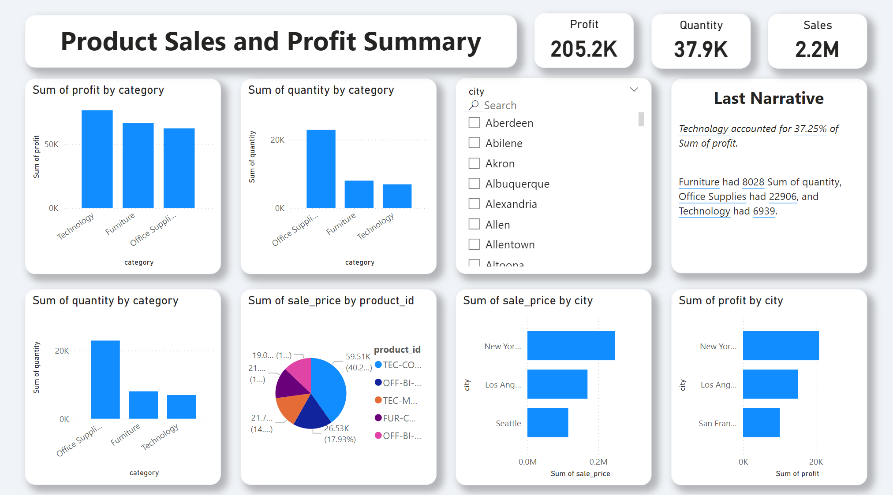

# End-to-End Data Analysis: From Kaggle API to Pandas Data Cleaning to PostgreSQL Data Analysis to Power BI Dashboards

## 📊 Project Overview

A comprehensive data analysis project that demonstrates the complete data pipeline from data collection to visualization. The project analyzes sales, profit, and revenue data using various tools and technologies.

## 🛠️ Technologies Used
- Python (Pandas) for data cleaning
- Kaggle API for data collection
- PostgreSQL for data storage and analysis
- Power BI for visualization
- SQL for data querying

## 📋 Project Structure
1. **Data Collection**
   - Utilized Kaggle API to fetch CSV datasets
   - Automated data retrieval process

2. **Data Cleaning (Python/Pandas)**
   - Handled missing values
   - Standardized data formats
   - Created derived columns
   - Removed duplicates

3. **Database Operations**
   - PostgreSQL database setup
   - Data import and storage
   - Complex SQL queries for analysis
     Creating Table
     ```
     create table afra_pd(
				order_id int primary key,
				order_date date,
				ship_mode varchar(20),
				segment varchar(20),
				country varchar(20),
				city varchar(20),
				state varchar(20),
				postal_code varchar(20),
				region varchar(20),
				category varchar(20),
				sub_category varchar(20),
				product_id varchar(20),
				quantity int,
				discount decimal(7,2),
				sale_price decimal(7,2),
				profit decimal(7,2));
      ```


4. **Data Analysis**
Key insights revealed through SQL analysis:
- Top 10 revenue-generating products
- Regional product performance analysis
- Month-over-month growth comparison (2022 vs 2023)
- Category-wise monthly sales performance
- Sub-category profit growth analysis

  # 📊 SQL Query Explanations with Emojis 🌟


---

## 1️⃣ Query 1: Find Top 10 Highest Revenue Generating Products 🛍️💰

```sql
--Q-1: find top 10 highest revenue generating products 

SELECT
      product_id, 
      SUM(sale_price)
FROM 
      afra_pd
GROUP BY 
      product_id
ORDER BY 
      SUM(sale_price) DESC
LIMIT 10;
```
### Explanation

- **`SELECT product_id, SUM(sale_price)`** ➡️ We want to find the total revenue (`SUM(sale_price)`) generated for each product (`product_id`).

- **`FROM afra_pd`** ➡️ The data is coming from the `afra_pd` table.

- **`GROUP BY product_id`** ➡️ Group the results by `product_id` so we can calculate the sum for each product.

- **`ORDER BY SUM(sale_price) DESC`** ➡️ Sort the products by total revenue, from highest to lowest.

- **`LIMIT 10`** ➡️ Only show the top 10 highest revenue-generating products.


## 2️⃣ Query 2: Find Top 5 Highest Selling Products in Each Region 🏘️📈
```
WITH cte AS (
        SELECT 
            region,
            product_id,
            SUM(sale_price) AS sales
        FROM 
            afra_pd
        GROUP BY 
            region, product_id
)
SELECT * 
FROM (
        SELECT *,
               ROW_NUMBER() OVER(PARTITION BY region ORDER BY sales DESC) AS rn
        FROM cte
) A
WHERE rn <= 5;
```

### Explanation

- **`WITH cte AS (...)`** ➡️ We create a Common Table Expression (CTE) `cte` to calculate the total sales for each product in every region.

- **`ROW_NUMBER() OVER(PARTITION BY region ORDER BY sales DESC)`** ➡️ For each region, assign a rank (`ROW_NUMBER()`) based on the total sales of each product, with the highest sales ranked first.

- **`SELECT * FROM (...) WHERE rn <= 5`** ➡️ Filter the results to only include the top 5 products for each region 5️⃣.

## 3️⃣ Query 3: Month-over-Month Growth Comparison for Sales in 2022 vs. 2023
### Purpose
To compare sales growth month-over-month between 2022 and 2023.
SQL Code (Microsoft SQL Server)

```
WITH cte AS (
    SELECT 
        YEAR(order_date) AS order_year,
        MONTH(order_date) AS order_month,
        SUM(sale_price) AS sales
    FROM 
        df_orders
    GROUP BY 
        YEAR(order_date), MONTH(order_date)
)
SELECT 
    order_month,
    SUM(CASE WHEN order_year = 2022 THEN sales ELSE 0 END) AS sales_2022,
    SUM(CASE WHEN order_year = 2023 THEN sales ELSE 0 END) AS sales_2023
FROM 
    cte
GROUP BY 
    order_month
ORDER BY 
    order_month;
```
Explanation
YEAR() and MONTH(): Extracts year and month from order_date.
SUM(CASE WHEN ...): Calculates total sales for each year.
GROUP BY: Groups results by month.
ORDER BY: Sorts results by month.

## 4️⃣ Query 4: Highest Sales Month for Each Category
### Purpose
To determine which month had the highest sales for each product category.
SQL Code (Microsoft SQL Server)
```sql
WITH cte AS (
    SELECT 
        category,
        FORMAT(order_date, 'yyyyMM') AS order_year_month,
        SUM(sale_price) AS sales
    FROM 
        df_orders
    GROUP BY 
        category, FORMAT(order_date, 'yyyyMM')
)
SELECT *
FROM (
    SELECT *,
        ROW_NUMBER() OVER(PARTITION BY category ORDER BY sales DESC) AS rn
    FROM cte
) a
WHERE rn = 1;
```
### Explanation 📝:

- **FORMAT(order_date, 'yyyyMM')** ➡️ Formats the `order_date` into a year and month format (`yyyyMM`) 📅.
- **ROW_NUMBER()** ➡️ Ranks the months by sales within each category, assigning a unique rank to each month based on the sales amount 📊.
- **WHERE rn = 1** ➡️ Filters the result to select only the month with the highest sales per category 🏅.


## 5️⃣ Query 5: Subcategory with Highest Growth by Profit in 2023 Compared to 2022
### Purpose
To identify which subcategory experienced the highest profit growth from 2022 to 2023.
SQL Code (PostgreSQL)
```sql
WITH cte AS (
    SELECT 
        sub_category,
        EXTRACT(YEAR FROM order_date) AS order_year,
        SUM(sale_price) AS sales
    FROM 
        afra_pd
    GROUP BY 
        sub_category, order_year
),
cte2 AS (
    SELECT 
        sub_category,
        SUM(CASE WHEN order_year = 2022 THEN sales ELSE 0 END) AS sales_2022,
        SUM(CASE WHEN order_year = 2023 THEN sales ELSE 0 END) AS sales_2023
    FROM 
        cte
    GROUP BY 
        sub_category
)
SELECT 
    sub_category,
    sales_2022,
    sales_2023,
    (sales_2023 - sales_2022) AS sales_growth -- Profit growth calculation.
FROM 
    cte2
ORDER BY 
    sales_growth DESC LIMIT 1;
```
### Explanation 📝:

- **EXTRACT(YEAR FROM ...)** ➡️ Retrieves the year from the `order_date` to separate data by year 📆.
- **SUM(CASE WHEN ...)** ➡️ Sums up profits for each year per subcategory by using conditional aggregation 💰.
- **(sales_2023 - sales_2022)** ➡️ Calculates the profit growth by subtracting sales in 2022 from sales in 2023 📈.
- **ORDER BY ... LIMIT 1** ➡️ Sorts the results to return only the subcategory with the highest growth 🏅.

5. **Data Visualization**
Created interactive dashboards in Power BI showing:

- Product sales and profit summary
- Regional performance metrics
- Category-wise analysis
- Growth trends

## 📈 Key Findings
- Technology accounted for 37.25% of total profit
- Furniture had 8,028 units in quantity
- Office Supplies reached 22,906 units
- Technology achieved 6,939 units

## 🔄 Project Workflow
1. Data Collection → 2. Cleaning → 3. Database Import → 4. Analysis → 5. Visualization

## 👨‍💻 Contact Information
- WhatsApp: [Contact Me](https://api.whatsapp.com/send?phone=8801687373830)
- Facebook: [seotanvirbd](https://www.facebook.com/seotanvirbd)
- LinkedIn: [seotanvirbd](https://www.linkedin.com/in/seotanvirbd/)
- YouTube: [@tanvirbinali2200](https://www.youtube.com/@tanvirbinali2200)
- Email: tanvirafra1@gmail.com
- Blog & Portfolio: [seotanvirbd.com](https://seotanvirbd.com/)

## 📝 License
This project is open source and available under the [MIT License](LICENSE).
